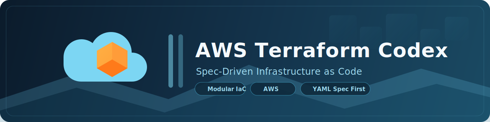
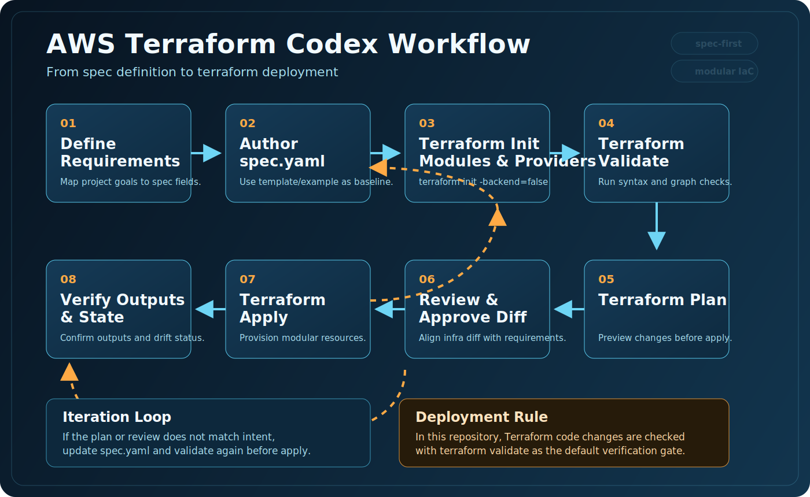

# AWS Terraform Codex



한국어 문서입니다. For English documentation, see [`README.md`](./README.md).

스펙 중심으로 AWS 인프라를 정의하고, Terraform 모듈이 이를 해석해 프로비저닝하는 저장소입니다.

이 프로젝트의 핵심은 간단합니다. 인프라 요구사항은 `spec.yaml`에 선언하고, 루트 모듈은 이를 읽어 얇게 오케스트레이션하며, 실제 리소스 생성 책임은 도메인별 모듈에 위임합니다.

## 한눈에 보기

- `spec.yaml`이 단일 입력 소스입니다.
- 루트 Terraform은 YAML을 읽고 리소스 타입별로 분류합니다.
- 실제 구현은 도메인 모듈로 분리되어 있습니다.
- 하드코딩보다 명시적인 입력/출력 계약을 우선합니다.
- Terraform 코드 변경 검증은 `terraform validate`를 기본으로 합니다.

## 왜 이렇게 구성했나요

이 저장소는 Terraform 코드를 여기저기 직접 수정하는 방식보다, 요구사항을 먼저 스펙으로 정리한 뒤 모듈이 이를 일관되게 해석하는 방식을 지향합니다.

이 접근의 장점은 다음과 같습니다.

- 요구사항과 구현의 경계가 분명합니다.
- 반복되는 인프라 패턴을 모듈로 재사용할 수 있습니다.
- 루트 구성이 얇아져 변경 영향도를 읽기 쉬워집니다.
- 새 리소스를 추가할 때 어디를 수정해야 하는지 명확합니다.

## 워크플로우



스펙 정의부터 Terraform 배포까지의 기본 흐름을 나타내며, `plan`/리뷰 결과에 따라 `apply` 전에 `spec.yaml`을 갱신하는 반복 루프를 포함합니다.

## 빠른 시작

### 1. 사전 준비

- Terraform `>= 1.5.0`
- AWS Provider `>= 5.33.0`
- 필요 시 AWS CLI 프로파일 설정
- `k8s_target_group_bindings`를 사용할 경우 `kubectl` 설치
- Graphviz DOT -> D2 변환 스크립트를 위한 Python `>= 3.8`
- `just graph` 사용 시 Graphviz (`dot`) 설치
- 선택 사항: `graph.d2`를 이미지로 렌더링할 때 D2 CLI (`d2`)

루트 모듈은 아래 설정을 사용합니다.

- 기본 스펙 파일: `spec.yaml`
- 대체 스펙 파일:
  - `plan`, `apply`, `destroy`는 `-var="spec_file=..."`
  - `validate`는 `TF_VAR_spec_file=...`

### 2. 스펙 파일 만들기

템플릿 또는 예제를 기준으로 시작합니다.

```bash
cp spec.example.yaml spec.yaml
```

또는 더 빈 틀에 가까운 템플릿을 기준으로 작성할 수 있습니다.

- `spec.template.yaml`: 스키마 중심 템플릿
- `spec.example.yaml`: 실사용 예시
- `spec.schema.yaml`: 구조 검증을 위한 스키마 참고

### 3. 스펙 수정하기

`spec.yaml`에서 최소한 아래 항목을 채웁니다.

```yaml
project:
  name: "my-project"
  profile: "my-aws-profile"
  region: "ap-northeast-2"
  environment: "dev"
  managed_by: "terraform-codex"
  maintainer: "platform-team@example.com"
  resources: []
```

리소스는 `resources` 배열 안에서 타입별 블록으로 선언합니다.

```yaml
project:
  name: "my-project"
  profile: "my-aws-profile"
  region: "ap-northeast-2"
  environment: "dev"
  managed_by: "terraform-codex"
  maintainer: "platform-team@example.com"

  resources:
    - vpcs:
        - name: "main-vpc"
          cidr: "10.0.0.0/16"
          additional_cidr_blocks:
            - "10.1.0.0/16"
          tags:
            Service: "network"

    - subnets:
        - name: "private-a"
          vpc: "main-vpc"
          availability_zone: "ap-northeast-2a"
          cidr: "10.1.1.0/24"
```

아래 체크리스트를 기준으로 스펙을 편집하면 가독성과 일관성을 유지하기 쉽습니다.

#### 핵심 규칙

- 참조는 명시 키 사용을 권장합니다. ID는 `*_id`, 이름은 `*_name`, ARN은 `*_arn`(`*_ids`/`*_names` 포함)으로 작성하세요. 기존 혼용 키는 하위 호환으로 계속 지원됩니다.
- 현재 스펙에서 관리하지 않는 네트워크 리소스를 참조해도 Terraform이 기존 AWS 리소스를 `Name` 태그 기준으로 조회해 실제 ID로 매핑합니다(보안 그룹은 SG name 기준 조회).
- `project.environment`, `project.managed_by`, `project.maintainer`는 필수입니다. 루트 provider의 `default_tags`를 통해 `Environment`, `ManagedBy`, `Maintainer`가 전역 적용됩니다.
- `Name` 태그는 각 리소스의 논리 식별자(`name`, `family`, `domain_name`, `alias` 등)로 자동 적용되므로 `tags.Name`를 반복 입력할 필요가 없습니다.
- Terraform state에 없는 AWS 리소스는 이미 존재해도 Terraform이 수정/삭제하지 않습니다.
- 권한 레이어까지 강제하려면 `aws:ResourceTag/ManagedBy`가 프로젝트 값과 다를 때 update/delete를 거부하는 IAM/SCP 정책을 함께 고려하세요.
- `security_groups` 규칙에서 `source.type`/`destination.type = security-group`일 때 `value`는 논리 SG 이름 또는 실제 SG ID(`sg-...`)를 사용할 수 있습니다.
- `security_groups` 규칙에서 `source.type`/`destination.type = prefix-list`일 때 `value`는 실제 Prefix List ID(`pl-...`) 또는 관리형 Prefix List 이름(예: `com.amazonaws.global.cloudfront.origin-facing`)을 사용할 수 있으며, 내부적으로 `aws_ec2_managed_prefix_list`로 해석됩니다.
- `security_groups.description`, `rds_subnet_groups.description`, `rds_parameter_groups.description`은 선택값이며, 미입력 시 provider 기본값 `"Managed by Terraform"` 대신 빈 문자열(`""`)이 설정됩니다.
- Security Group rule 식별자와 Route Table association은 목록 순서와 무관한 key를 사용하므로, 단순 순서 변경만으로 리소스 주소 드리프트가 발생하지 않습니다.
- `iam_roles`와 `iam_policies`는 `source: existing`으로 기존 IAM Role/Policy를 읽어와 동일한 논리 참조 맵에 노출할 수 있습니다. AWS 실제 이름이 `name`과 다르면 `role_name`/`policy_name`을, 조회 없이 ARN을 직접 쓰려면 `role_arn`/`policy_arn`을 사용하세요.
- `iam_roles.policies`, `iam_users.policies`, `iam_groups.policies`는 정책 ARN뿐 아니라 `iam_policies`의 논리 이름도 사용할 수 있습니다. 논리 정책 이름은 관리형 정책과 기존 정책 모두를 가리킬 수 있습니다.
- IAM OIDC Provider: `iam_oidc_providers`로 IAM OpenID Connect Provider를 생성할 수 있고, `iam_roles.assume_role_policy`는 `templatestring()`으로 `${oidc_provider["<이름-또는-URL>"].arn}`(별칭 `${iam_oidc_provider["<이름-또는-URL>"].arn}`) 참조를 지원합니다.
- `iam_policies.document_json`은 `${oidc_provider[...]}` / `${iam_oidc_provider[...]}`뿐 아니라 `${cloudfront_distribution["<name>"].arn}` 보간도 지원합니다. CloudFront ARN은 같은 apply에서 생성되는 관리형 `cloudfront_distributions` 결과를 먼저 사용하고, 필요 시 스펙의 `distribution_arn` 또는 `distribution_id`로 fallback 합니다. 정책 JSON에서 `${...}`를 리터럴로 써야 하면 `$${...}`로 이스케이프하세요.
- CodeDeploy: `codedeploy_applications`, `codedeploy_deployment_groups`를 지원합니다. Deployment Group의 `service_role_name`은 `iam_roles` 논리 이름으로 해석되고, `autoscaling_groups`와 `load_balancer_info.target_groups`도 논리 이름 기반 참조를 지원합니다.
- RDS Enhanced Monitoring: 리터럴 ARN은 `rds_instances.monitoring_role_arn`, IAM Role 이름 참조는 `rds_instances.monitoring_role_name`을 사용하세요(`iam_roles`/기존 IAM Role 조회 지원).
- EC2 IAM Profile: EC2 trust(`ec2.amazonaws.com`)가 있는 IAM Role에 대해 동일 이름의 IAM Instance Profile을 자동 생성하므로 `ec2_instances.iam_role`에 Role 이름을 직접 사용할 수 있습니다.

#### 기능별 메모

- EKS Pod Identity: `role_name`(논리 role 이름) 또는 `role_arn`(리터럴 ARN) 사용을 권장합니다. `role_name`은 관리형 Role, `iam_roles.source: existing` Role, 이름으로 자동 조회된 기존 Role을 해석할 수 있습니다. Pod Identity role trust principal은 `pods.eks.amazonaws.com`이며 `sts:AssumeRole`, `sts:TagSession`을 포함해야 합니다.
- IAM identity: 스펙 기반 워크플로우에서 `iam_roles`, `iam_users`, `iam_groups`, customer-managed `iam_policies`를 지원합니다. 기존 IAM Role/Policy는 `source: existing`으로 선언해 참조 전용으로 사용할 수 있습니다.
- IAM Group membership: `iam_groups.users`(별칭 `iam_groups.user_names`)로 `aws_iam_group_membership` 기반 그룹 멤버십을 관리할 수 있고, 필요하면 `membership_name`으로 멤버십 리소스 이름을 지정할 수 있습니다.
- Inline IAM policy: `iam_roles.inline_policies`, `iam_users.inline_policies`, `iam_groups.inline_policies`, `eks_irsa_roles.inline_policies`는 `document_json` 또는 `document_url` 중 하나를 사용할 수 있습니다(예: `https://raw.githubusercontent.com/kubernetes-sigs/aws-load-balancer-controller/refs/heads/main/docs/install/iam_policy.json`).
- Launch Template AMI: `image_id`는 `ami-*` 또는 AMI 이름을 받을 수 있고, AMI 이름 조회는 `image_owners`(기본 `["self"]`), `image_most_recent`(기본 `true`)로 제어합니다.
- Launch Template user data: 우선순위는 `user_data_base64` > `user_data_file` > 인라인 `user_data`이며, `user_data_file`은 저장소 루트 기준 상대경로/절대경로를 모두 지원합니다.
- Launch Template 보간: `vpc_security_groups`/`security_groups`는 `templatestring()`으로 `${security_group["<name>"]}`, `${cluster["<eks-cluster-name>"].security_group_id}`(별칭 `${eks_cluster["<eks-cluster-name>"].security_group_id}`)를 참조할 수 있습니다.
- EC2 Auto Scaling Group: `ec2_auto_scaling_groups`는 관리 중인 `ec2_launch_templates`와 `ec2_alb_target_groups`를 논리 이름으로 참조할 수 있으며, 기존 Launch Template 이름/ID나 Target Group ARN도 그대로 받을 수 있습니다.
- RDS Parameter Group: `rds_parameter_groups`로 `aws_db_parameter_group`를 관리할 수 있고, `rds_instances.parameter_group_name`은 관리 대상 parameter group 이름으로 해석됩니다.
- ACM 인증서: `acm_certificates`는 `source=managed`(Terraform으로 ACM 인증서 생성)와 `source=existing`(기존 ACM 인증서 재사용)를 지원합니다. `name` 필드로 논리 참조명을 지정할 수 있고(미지정 시 `domain_name` 사용), `region` 필드로 인증서 리전도 지정할 수 있습니다(CloudFront용은 `us-east-1`). `source=existing`에서는 `certificate_arn`을 직접 지정하거나, `domain_name` + `lookup_statuses`/`most_recent` 조합으로 조회할 수 있습니다. 관리형 인증서는 `wait_for_issued`(선택적으로 `validation_record_fqdns` 함께 사용)로 `ISSUED` 상태까지 대기할 수 있습니다.
- ALB 리스너: `ec2_load_balancers.listeners`는 `default_action.type = fixed-response`를 지원하며, `fixed_response.content_type`, `fixed_response.status_code`, `fixed_response.message_body`(선택)를 지정할 수 있습니다. HTTPS 리스너 인증서는 `certificate_arn` 직접 지정 또는 `acm_certificate_name`(`acm_certificate_domain_name` 별칭)으로 `acm_certificates[].name`(없으면 `domain_name`)을 참조해 사용할 수 있습니다. `default_action`을 생략하면 첫 번째 `target_groups` 항목으로 forward 액션이 기본 적용됩니다.
- KMS 키 import 참조: `kms_keys`는 `existing_key_id`를 지원해 기존 Customer-managed KMS 키를 신규 생성 없이 참조할 수 있습니다. 기존 alias를 Terraform으로 관리하지 않으려면 `create_alias: false`를 사용하세요.
- EC2 Auto Scaling instance refresh: `instance_refresh`로 rolling 교체를 정의할 수 있고, `triggers`, `min_healthy_percentage`, `instance_warmup` 같은 세부 옵션을 함께 지정할 수 있습니다.
- EKS Add-on 보간: `eks_addons.configuration_values`도 위 cluster security-group 보간을 지원하며 `${subnet["<name>"]}`, `${security_group["<name>"]}`와 함께 사용할 수 있습니다.
- EKS Add-on 배포 단계: `eks_addons.provision_phase`는 `before_nodegroup`, `after_nodegroup`, `auto`(기본값)를 지원합니다. `before_nodegroup` Add-on은 Node Group 이전, `after_nodegroup` Add-on은 Node Group 이후에 적용됩니다.
- EKS Add-on `auto` 기본값: `vpc-cni`, `kube-proxy`, `eks-pod-identity-agent`는 `before_nodegroup`으로 분류되고, 그 외 Add-on(예: `coredns`, `aws-ebs-csi-driver`)은 Worker Node 생성 전 replica readiness 정체를 피하기 위해 `after_nodegroup`으로 분류됩니다.
- EKS 의존성 순서: Launch Template이 `cluster.*.security_group_id`를 참조하면 Terraform이 EKS cluster를 먼저 해석한 뒤 Launch Template을 생성해 Node Group에서 안전하게 참조됩니다.
- EKS Node Group 버전: `launch_template.version`은 명시 버전과 `$Latest`/`$Default`를 모두 지원하고, 반복 plan diff 방지를 위해 내부적으로 숫자 버전으로 정규화됩니다.
- EKS Helm + private ECR OCI (`oci://<account>.dkr.ecr.<region>.amazonaws.com/...`): 모듈이 ECR 인증 토큰을 자동 조회해 Helm 저장소 인증 정보를 주입합니다.
- EKS Helm Job 대기: `wait_for_jobs`를 지원하며 AWS Load Balancer Controller 같은 chart에서 webhook readiness Job 완료까지 대기할 수 있습니다.
- EKS Helm 이미지 정책: `image_pull_policy`는 Helm `set`의 `image.pullPolicy` 축약 필드입니다(`set`에 `image.pullPolicy`가 이미 있으면 무시).
- Kubernetes Service: `k8s_services`로 클러스터 내부 트래픽 및 TargetGroupBinding 백엔드로 사용하는 `Service` 리소스를 관리합니다.
- Kubernetes TargetGroupBinding: `k8s_target_group_bindings`는 `target_group_arn` 또는 `target_group_name` 중 하나가 필요하며, 모듈은 `aws eks update-kubeconfig` + `kubectl apply/delete` 방식으로 `elbv2.k8s.aws/v1beta1` `TargetGroupBinding`를 반영합니다(AWS Load Balancer Controller CRD와 backend endpoint가 잡힌 Kubernetes Service 필요).
- CloudFront Function/Distribution: `cloudfront_functions`로 `aws_cloudfront_function` 리소스(`code` 또는 `code_file`, runtime, publish)를 프로비저닝할 수 있고, `cloudfront_distributions`는 `function_name`(논리 이름) 또는 `function_arn`으로 함수를 연결할 수 있습니다. CloudFront 참조는 `web_acl_name`/`web_acl_arn`, `origin_access_control_name`/`origin_access_control_id`, `target_origin_name`/`target_origin_id`처럼 명시 쌍을 지원합니다. 캐시 동작 정책은 `*_policy_id`와 `*_policy_name`(`cache_policy_name`, `origin_request_policy_name`, `response_headers_policy_name`)을 모두 지원하며, `*_policy_name` 사용을 권장합니다. Managed 정책 이름은 `Managed-` 접두사 유무 모두 허용됩니다. `viewer_certificate`에서는 `acm_certificate_name`(또는 `acm_certificate_domain_name`)으로 `acm_certificates[].name`(없으면 `domain_name`)의 ARN을 참조할 수 있습니다. CloudFront 커스텀 도메인은 `us-east-1` ACM 인증서를 사용해야 합니다.

### 4. 초기화 및 검증

모듈과 provider를 초기화한 뒤 검증합니다.

```bash
terraform init -backend=false
terraform validate
```

다른 스펙 파일을 쓰고 싶다면 다음처럼 지정할 수 있습니다.

```bash
TF_VAR_spec_file=spec.example.yaml terraform validate
```

### 5. 실제 배포가 필요할 때

이 저장소의 작업 원칙상 코드 변경 검증은 `terraform validate`를 기본으로 하지만, 실제 인프라 반영이 필요할 때는 일반적인 Terraform 흐름으로 진행할 수 있습니다.

```bash
terraform plan
terraform apply
```

대체 스펙 파일 사용 시:

```bash
terraform plan -var="spec_file=spec.example.yaml"
terraform apply -var="spec_file=spec.example.yaml"
```

스펙별로 state를 분리해서 하나씩 바로 실행하려면 Terraform workspace를 사용하세요.

```bash
terraform init
terraform workspace select spec-vdh-stg-01-network || terraform workspace new spec-vdh-stg-01-network
terraform plan  -var="spec_file=spec.vdh.stg.01.network.yaml"
terraform apply -var="spec_file=spec.vdh.stg.01.network.yaml"
```

## 작업 방법

이 저장소는 아래 순서로 작업할 때 가장 안정적으로 유지됩니다.

### 1. 요구사항을 먼저 `spec.yaml`로 번역합니다

예를 들어:

- 어떤 VPC가 필요한지
- 퍼블릭/프라이빗 서브넷이 몇 개인지
- EKS, RDS, Lambda, S3 같은 어떤 리소스가 필요한지
- 리소스 간 참조 관계가 무엇인지

이 정보를 먼저 스펙으로 정리합니다.

### 2. 구현은 도메인 모듈에 추가합니다

루트에서 리소스를 직접 많이 만들지 않습니다. 루트는 아래 역할에 집중합니다.

- `spec.yaml` 로드
- 리소스 타입별 분류
- 이름 기반 참조를 실제 ID로 해석
- 도메인 모듈 호출

실제 AWS 리소스 로직은 반드시 해당 도메인 모듈에서 구현하는 것을 권장합니다.

### 3. 루트 오케스트레이션은 얇게 유지합니다

새 리소스를 추가하더라도 아래 원칙을 지킵니다.

- 루트에는 분기와 연결만 둡니다.
- 리소스 생성 로직은 모듈로 이동합니다.
- 입력값은 명시적으로 받고, 출력값도 명시적으로 노출합니다.
- 모듈 내부에서 외부 값을 하드코딩하지 않습니다.

### 4. Terraform 변경 후에는 `terraform validate`로 확인합니다

이 저장소의 기본 검증 규칙은 단순합니다.

- Terraform 코드를 수정했다면 `terraform validate`만 수행합니다.

## 저장소 구조

```text
.
├── justfile
├── main.tf
├── modules_domains.tf
├── variables.tf
├── outputs.tf
├── versions.tf
├── spec.template.yaml
├── spec.example.yaml
├── spec.schema.yaml
├── scripts/
│   ├── graphviz_to_d2.py
│   └── graphviz_init_order.py
└── modules/
    ├── vpc/
    ├── subnet/
    ├── internet-gateway/
    ├── nat-gateway/
    ├── route-table/
    ├── security-group/
    ├── network-identity/
    ├── compute-storage/
    ├── eks-cluster/
    ├── eks-node-group/
    ├── eks-addon/
    ├── eks-extended/
    ├── edge-containers-observability/
    └── app-platform/
```

## 도메인별 책임

### Root Module

루트 모듈은 `spec.yaml`을 읽고 `yamldecode`로 파싱한 뒤, 리소스 타입별로 펼쳐서 각 모듈에 연결합니다.

대표 책임:

- `project.region`, `project.profile` 기반 AWS provider 설정
- `resources` 배열을 타입별 맵으로 변환
- 이름 기반 참조를 실제 리소스 ID로 매핑
- 모듈 호출 및 의존성 순서 관리
- Security Group 리소스와 SG 논리 rule 리소스를 EKS 모듈보다 먼저 적용하도록 순서 보장
- Security Group rule은 `aws_vpc_security_group_ingress_rule` / `aws_vpc_security_group_egress_rule` 분리 리소스로 관리해 재조정(churn) 이슈를 방지

### `modules/network-identity`

주로 네트워크 및 IAM 계층을 담당합니다.

- IAM Roles
- IAM Instance Profiles (EC2 trust role 대상)
- IAM Users
- IAM Policies
- Network ACLs
- VPC Endpoints
- VPC Flow Logs

### `modules/compute-storage`

컴퓨트와 스토리지 계층을 담당합니다.

- RDS
- EC2
- Launch Template
- EC2 Auto Scaling Group
- ALB
- S3

### `modules/eks-extended`

EKS 확장 구성을 담당합니다.

- EKS Fargate Profiles
- IRSA Roles
- Helm Releases
- Kubernetes Storage Classes
- Kubernetes Deployments
- Kubernetes Services
- Kubernetes TargetGroupBindings
- EKS Access Entries
- Pod Identity Associations
- 루트 오케스트레이션은 EKS cluster/node group/add-on 의존 신호를 `eks-extended`로 전달하며, 이를 통해 Helm/Kubernetes 작업은 클러스터 프로비저닝 선행조건 이후에 평가됩니다.
- Helm/Kubernetes 인증은 `aws eks get-token`을 사용하며, `project.profile`이 설정된 경우 해당 프로파일을 포함해 호출합니다.
- EKS cluster creator admin bootstrap이 비활성화된 경우, Helm/Kubernetes 리소스보다 먼저 Terraform 실행 주체에 대한 `eks_access_entries`를 정의해야 합니다.
- `eks-extended` 내부에서는 access entry 및 access policy association이 pod identity association보다 먼저 적용됩니다.
- EKS 오케스트레이션 순서는 `eks_clusters -> eks_addons(before_nodegroup) -> eks_node_groups -> eks_addons(after_nodegroup) -> eks_extended`로 고정됩니다.

### `modules/edge-containers-observability`

엣지, 컨테이너, 관측 영역을 담당합니다.

- WAF
- CloudFront
- ECS
- CloudWatch

### `modules/app-platform`

애플리케이션 플랫폼 계층을 담당합니다.

- KMS
- Secrets Manager
- ECR
- Lambda
- API Gateway HTTP API
- Route53
- ACM
- DynamoDB
- ElastiCache
- SQS
- SNS
- EventBridge

## 스펙 작성 팁

### 1. 논리 이름을 먼저 안정적으로 정하세요

이 저장소는 리소스 간 연결을 이름으로 많이 해석합니다. 따라서 아래처럼 일관된 논리 이름 규칙을 먼저 정해두면 관리가 쉬워집니다.

- `<project>-<environment>-vpc`
- `<project>-<environment>-private-a`
- `<project>-<environment>-eks-cluster`

### 2. 태그는 초기에 정리해두는 편이 좋습니다

운영 단계로 갈수록 태그 일관성이 중요해집니다.

```yaml
tags:
  Service: "network"
  Owner: "platform-team"
```

### 3. 예제를 먼저 복사한 뒤 줄여 나가면 빠릅니다

처음부터 빈 스펙을 작성하기보다 `spec.example.yaml`을 복사한 뒤 필요한 리소스만 남기는 방식이 더 안정적입니다.

### 4. 루트보다 모듈에 책임을 두세요

새 기능이 필요할 때 아래처럼 판단하면 좋습니다.

- 입력 스키마를 어떻게 받을지 먼저 결정
- 루트에서는 타입 분류와 매핑만 수행
- 실제 리소스 생성은 도메인 모듈에 구현

## 추천 작업 흐름

1. 요구사항을 읽고 `spec.yaml` 구조로 변환합니다.
2. 필요 리소스가 이미 지원되는지 `spec.template.yaml`과 각 모듈을 확인합니다.
3. 미지원 리소스라면 도메인에 맞는 모듈에 구현을 추가합니다.
4. 루트에서 최소한의 연결만 추가합니다.
5. `terraform init -backend=false` 후 `terraform validate`를 수행합니다.

## 자주 쓰는 명령

```bash
# 초기화
terraform init -backend=false

# 기본 spec.yaml 검증
terraform validate

# 특정 스펙 파일로 계획 확인
terraform plan -var="spec_file=spec.example.yaml"

# 특정 스펙 파일로 적용
terraform apply -var="spec_file=spec.example.yaml"
```

`justfile` 단축 명령으로도 스펙 파일을 지정해 실행할 수 있습니다.

```bash
# 기본 spec.yaml 검증
just validate

# 특정 스펙 파일 검증
just validate spec.example.yaml

# 특정 스펙 파일로 계획/적용/삭제
just plan spec.example.yaml
just apply spec.example.yaml
just destroy spec.example.yaml

# 기존 리소스를 state로 import
just import aws_s3_bucket.example my-bucket
just import aws_s3_bucket.example my-bucket spec.example.yaml
```

workspace를 자동 선택/생성해서 spec별 state를 분리하려면:

```bash
# workspace 기반 실행 전 1회 초기화
just init

# spec 파일명 기반 workspace + 실행
just plan-spec spec.vdh.stg.01.network.yaml
just apply-spec spec.vdh.stg.01.network.yaml
just destroy-spec spec.vdh.stg.01.network.yaml

# spec별 workspace + state로 import
just import-spec spec.vdh.stg.01.network.yaml aws_s3_bucket.example my-bucket
```

`graph.dot` 파일 생성 없이 Terraform 의존성 그래프(`graph.d2`, `graph.svg`)를 생성하려면:

```bash
# 기본 spec.yaml 기준 그래프 생성
just graph

# 특정 spec 파일 기준 그래프 생성
just graph spec.example.yaml

# 필요 시 terraform graph 추가 인자 전달
just graph spec.example.yaml -draw-cycles

# terraform graph 출력을 바로 D2로 변환
TF_VAR_spec_file="spec.example.yaml" terraform graph | python3 scripts/graphviz_to_d2.py --output graph.d2
```

D2 CLI가 설치되어 있다면 생성된 D2 파일을 렌더링할 수 있습니다.

```bash
d2 graph.d2 graph.d2.svg
```

Terraform 리소스 초기화 순서를 CLI 단계로 정리하려면:

```bash
# stdout으로 출력
just graph-order

# 특정 spec 파일 기준 출력
just graph-order spec.example.yaml

# 텍스트 파일로 저장
just graph-order spec.example.yaml graph.init-order.txt

# just 없이 직접 파이프 실행
TF_VAR_spec_file="spec.example.yaml" terraform graph | python3 scripts/graphviz_init_order.py
```

출력 예시:

```text
1. vpc['main']
2-1. subnet['private-a']
2-2. subnet['private-b']
```

## 협업 원칙

- 요구사항은 먼저 `spec.yaml`에 반영합니다.
- 루트 모듈은 얇게 유지합니다.
- 모듈 경계를 흐리지 않습니다.
- 입력/출력 계약을 명시적으로 유지합니다.
- 하드코딩을 피합니다.
- Terraform 변경 검증은 `terraform validate`로 수행합니다.

## 마무리

처음 시작할 때는 아래 세 파일만 먼저 보면 충분합니다.

- `spec.template.yaml`
- `spec.example.yaml`
- `main.tf`

그 다음 필요한 도메인 모듈로 내려가면 전체 흐름을 빠르게 이해할 수 있습니다.
